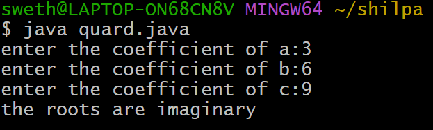

#EXPERIMENT 1
#QUADRATIC EXPRESSION
import java.util.Scanner;
class quard{
     public static void main(String[] args){
     Scanner s=new Scanner(System.in);
     System.out.print("enter the coefficient of a:");
     double a=s.nextDouble();
     System.out.print("enter the coefficient of b:");
     double b=s.nextDouble();
     System.out.print("enter the coefficient of c:");
     double c=s.nextDouble();
     s.close();
   double discriminent=b*b-4*a*c;
if(discriminent>0)
{
 double root1=(-b+Math.sqrt(discriminent))/2*a;
 double root2=(-b-Math.sqrt(discriminent))/2*a;
 System.out.println("the roots are real and distinct");
 System.out.println("root1="+root1);
 System.out.println("root2="+root2);
}
else if(discriminent==0)
{ 
 double root=-b/2*a;
  System.out.println("the roots are real and equal");
  System.out.println("root="+root);
}
else
{
 System.out.println("the roots are imaginary");
}
}
}
#OUTPUT:

